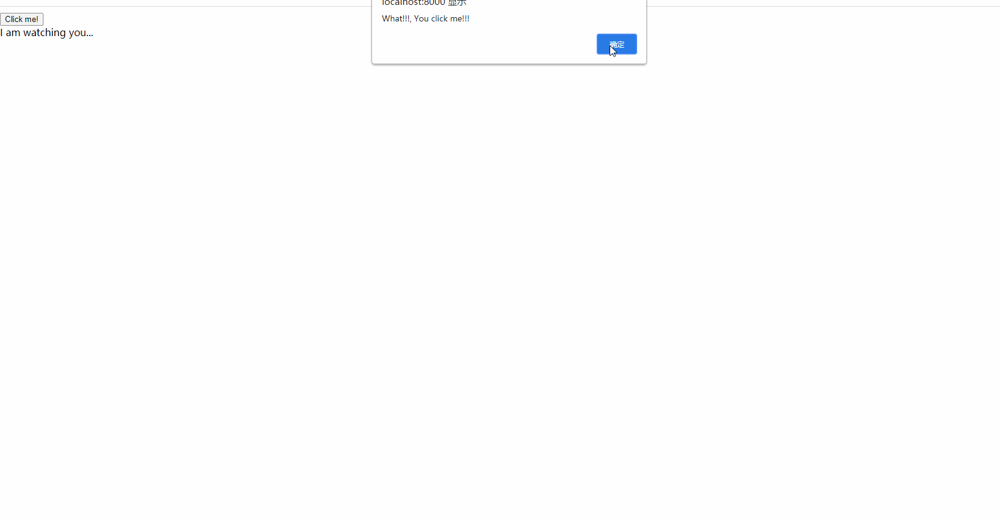

## Setup
1. Download Mono-Wasm SDK£º[Download](https://jenkins.mono-project.com/job/test-mono-mainline-wasm/label=ubuntu-1804-amd64/lastSuccessfulBuild/Azure/), get more here: [More details](https://github.com/mono/mono/blob/main/sdks/wasm/docs/getting-started/obtain-wasm-sdk.md#download-webassembly-sdk). (this project contains downloaded packages, and offline nuget is already configrued)
2. Run it.

